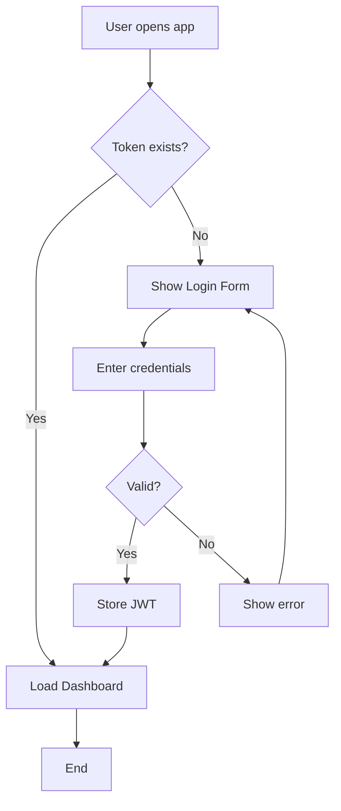
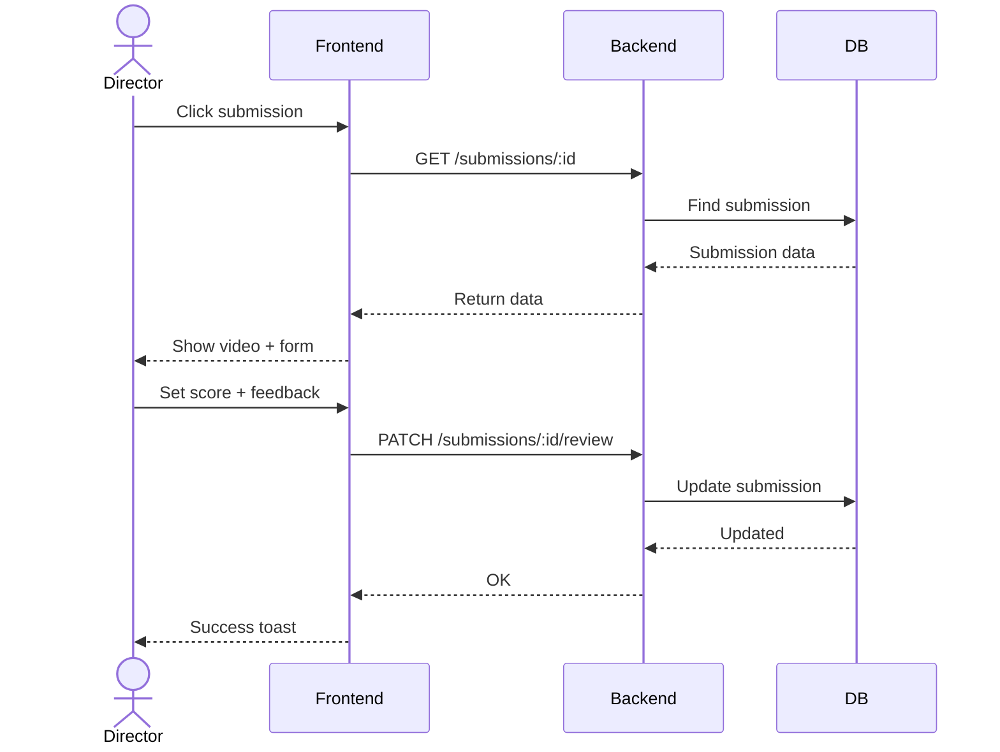
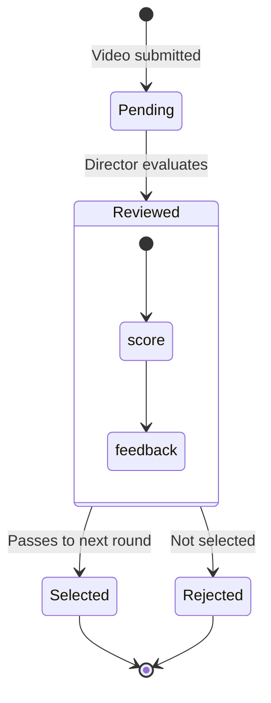
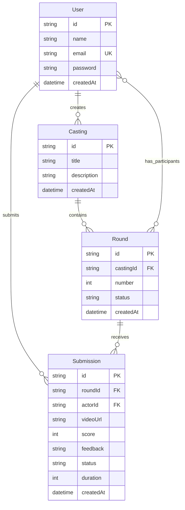
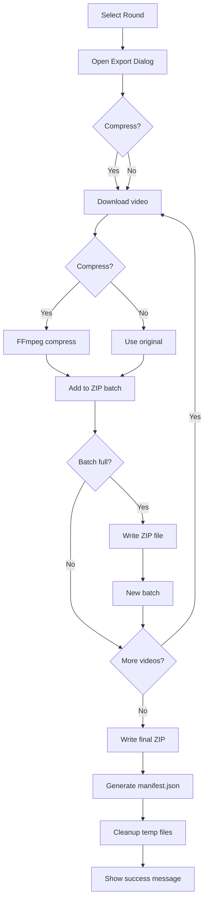

# Sample Diagrams

## 1. Login Flow (Flowchart)

```mermaid
flowchart TD
    A[User opens app] --> B{Token exists?}
    B -->|Yes| C[Load Dashboard]
    B -->|No| D[Show Login Form]
    D --> E[Enter credentials]
    E --> F{Valid?}
    F -->|Yes| G[Store JWT]
    F -->|No| H[Show error]
    G --> C
    H --> D
    C --> I[End]
```

## 2. Submission Review (Sequence)

```mermaid
sequenceDiagram
    actor Director
    participant Frontend
    participant Backend
    participant DB

    Director->>Frontend: Click submission
    Frontend->>Backend: GET /submissions/:id
    Backend->>DB: Find submission
    DB-->>Backend: Submission data
    Backend-->>Frontend: Return data
    Frontend-->>Director: Show video + form

    Director->>Frontend: Set score + feedback
    Frontend->>Backend: PATCH /submissions/:id/review
    Backend->>DB: Update submission
    DB-->>Backend: Updated
    Backend-->>Frontend: OK
    Frontend-->>Director: Success toast
```

## 3. Submission Status (State)

```mermaid
stateDiagram-v2
    [*] --> Pending: Video submitted
    Pending --> Reviewed: Director evaluates
    Reviewed --> Selected: Passes to next round
    Reviewed --> Rejected: Not selected
    Selected --> [*]
    Rejected --> [*]

    state Reviewed {
        [*] --> score
        score --> feedback
    }
```

## 4. Data Model (ER)

```mermaid
erDiagram
    User ||--o{ Casting : creates
    User ||--o{ Submission : submits
    Casting ||--o{ Round : contains
    Round ||--o{ Submission : receives
    Round }o--o{ User : has_participants

    User {
        string id PK
        string name
        string email UK
        string password
        datetime createdAt
    }

    Casting {
        string id PK
        string title
        string description
        datetime createdAt
    }

    Round {
        string id PK
        string castingId FK
        int number
        string status
        datetime createdAt
    }

    Submission {
        string id PK
        string roundId FK
        string actorId FK
        string videoUrl
        int score
        string feedback
        string status
        int duration
        datetime createdAt
    }
```

## 5. Video Export Process (Flowchart)

```mermaid
flowchart TD
    A[Select Round] --> B[Open Export Dialog]
    B --> C{Compress?}
    C -->|Yes| D[Download video]
    C -->|No| D
    D --> E{Compress?}
    E -->|Yes| F[FFmpeg compress]
    E -->|No| G[Use original]
    F --> H[Add to ZIP batch]
    G --> H
    H --> I{Batch full?}
    I -->|Yes| J[Write ZIP file]
    I -->|No| K{More videos?}
    J --> L[New batch]
    L --> K
    K -->|Yes| D
    K -->|No| M[Write final ZIP]
    M --> N[Generate manifest.json]
    N --> O[Cleanup temp files]
    O --> P[Show success message]
```
