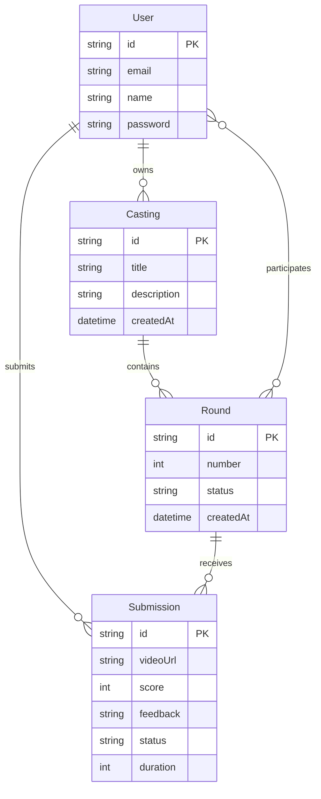

# ER Diagram Template

## Relationship Types

| Symbol | Meaning |
|--------|---------|
| `\|\|--o{` | One to zero-or-many |
| `\|\|--\|\|` | One to one |
| `\|\|--\|{` | One to one-or-many |
| `}o--o{` | Many to many |
| `}o--\|\|` | Many to one |

## Cardinality Notation

| Notation | Meaning |
|----------|---------|
| `\|\|` | Exactly one |
| `\|o` | Zero or one |
| `\|{` | One or many |
| `o{` | Zero or many |

## Field Types

| Type | Example |
|------|---------|
| `string` | text |
| `int` | integer |
| `float` | decimal |
| `bool` | boolean |
| `date` | date only |
| `datetime` | date + time |
| `json` | JSON object |

## Keys

| Key | Syntax |
|-----|--------|
| Primary | `PK` |
| Foreign | `FK` |
| Unique | `UK` |
