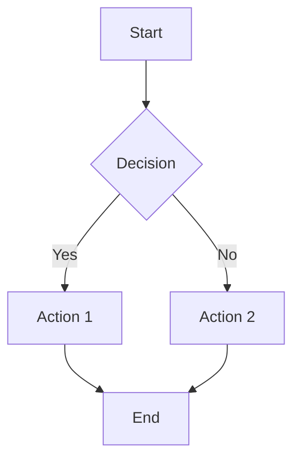
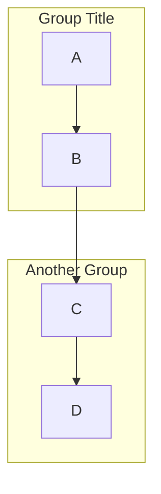

# Flowchart Template

## Node Shapes

| Shape | Syntax | Use |
|-------|--------|-----|
| Rectangle | `[text]` | Process step |
| Rounded | `(text)` | Start/End |
| Diamond | `{text}` | Decision |
| Circle | `((text))` | Connector |
| Stadium | `([text])` | Terminal |
| Subroutine | `[[text]]` | Subprocess |
| Cylinder | `[(text)]` Database |
| Flag | `>text]` | Flag |

## Connectors

| Type | Syntax |
|------|--------|
| Arrow | `-->` |
| Dotted | `-.->` |
| Thick | `==>` |
| Link | `---` |

## Labels

## Subgraphs

