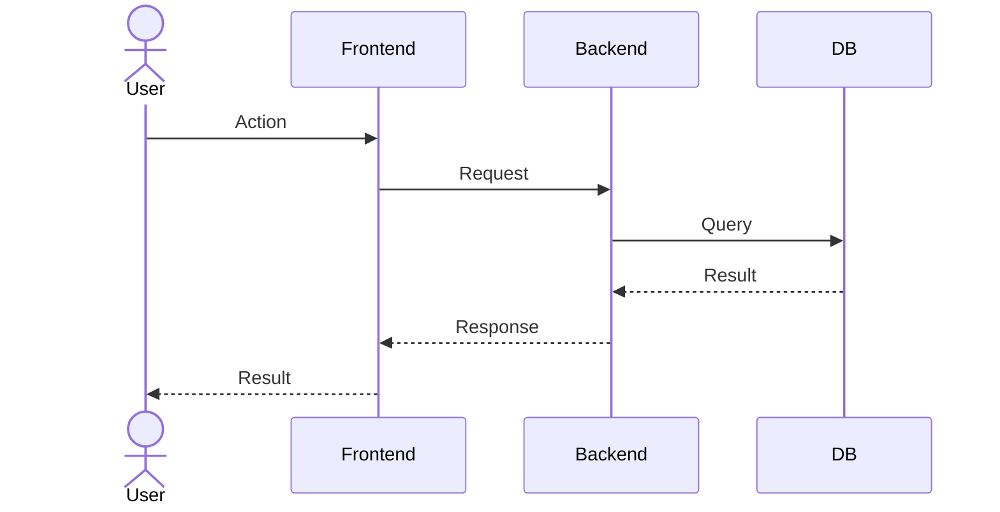
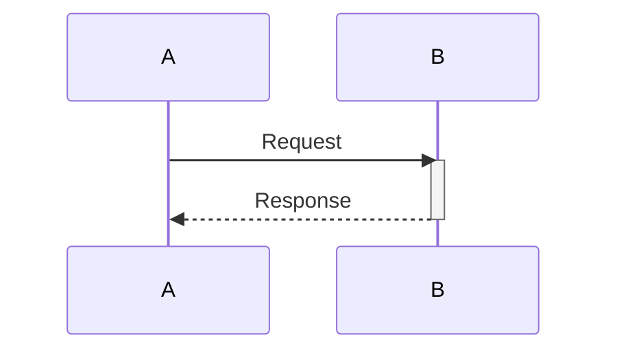
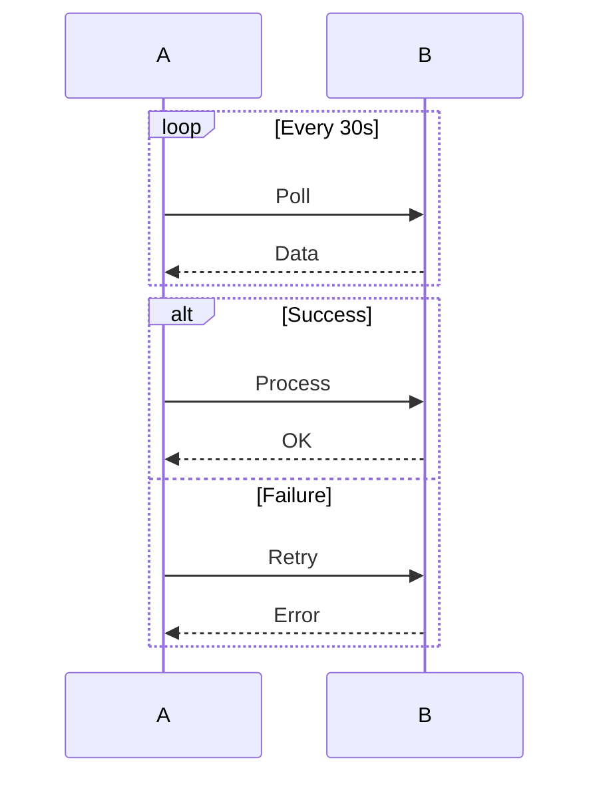
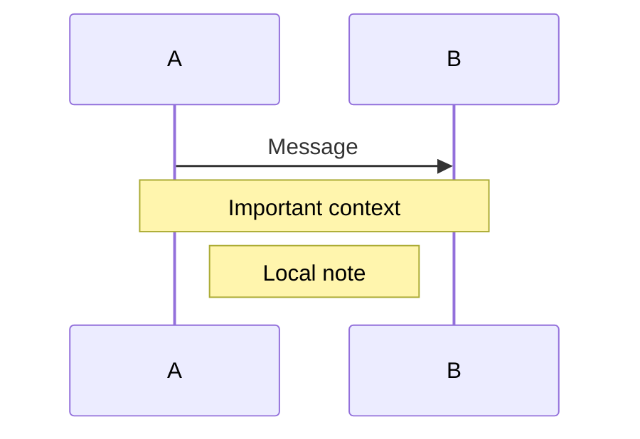

# Sequence Diagram Template

## Message Types

| Type | Syntax | Description |
|------|--------|-------------|
| Solid arrow | `->>` | Synchronous message |
| Dashed arrow | `-->>` | Response |
| Solid line | `->` | Solid arrow (no fill) |
| Dashed line | `-->` | Dashed line (no fill) |

## Activations

## Loops and Alternatives

## Notes

