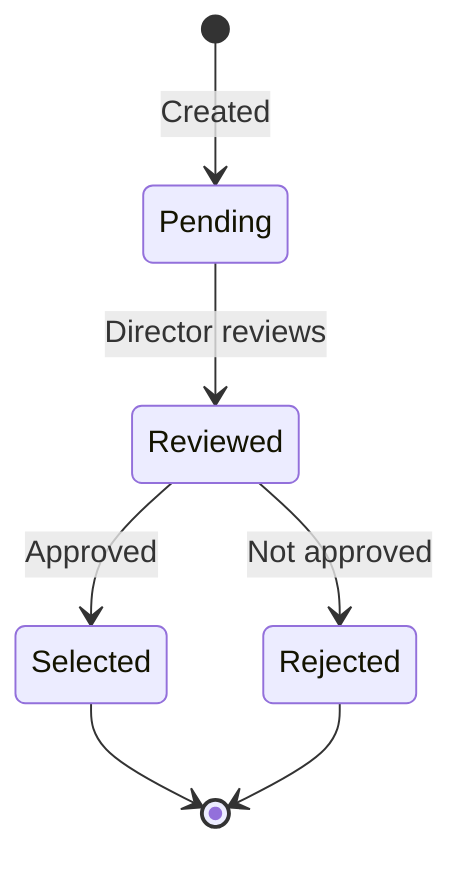
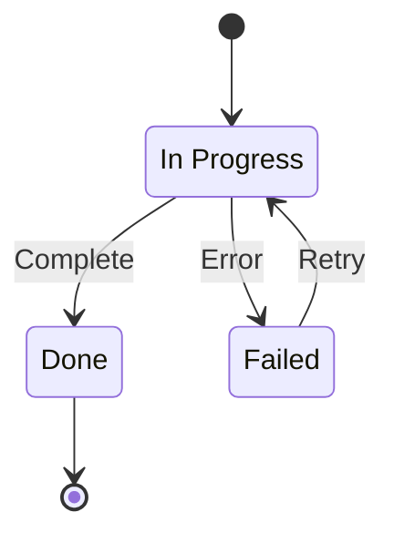
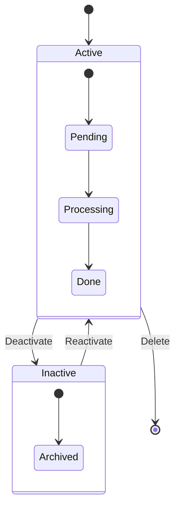

# State Diagram Template

## Transitions

## Composite States

## Notes

| Element | Description |
|---------|-------------|
| `[*]` | Start/End state |
| `state "name" as alias` | Named state |
| `-->` | Transition |
| `: description` | Transition label |
| `note left of` | Note attached to state |
