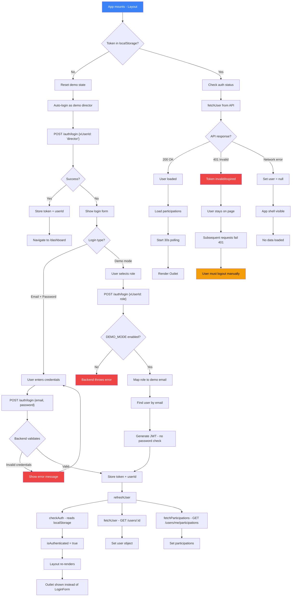

# Login Flow — Frontend Web

## Token Lifecycle

```mermaid
flowchart LR
    A[JWT Generated] -->|24h expiry| B[Valid Token]
    B -->|Time passes| C[Expired Token]
    C -->|API call| D[401 Response]
    D --> E[fetchUser fails]
    E --> F[user = null]
    F --> G[App still shows Outlet]
    G --> H[All requests fail]
    H --> I[Manual logout required]
    
    style A fill:#22C55E,color:#fff
    style C fill:#F59E0B,color:#000
    style D fill:#EF4444,color:#fff
    style I fill:#EF4444,color:#fff
```

## Key Files

| File | Role |
|------|------|
| `frontend/src/components/Layout.tsx` | Gatekeeper, renders LoginForm or Outlet |
| `frontend/src/components/LoginForm.tsx` | Email/password form only |
| `frontend/src/context/UserContext.tsx` | Login/logout logic, token storage |
| `frontend/src/api/client.ts` | HTTP client, cache, 401 handling |
| `backend/src/infrastructure/middleware/auth.ts` | JWT verification |
| `backend/src/application/use-cases/LoginUseCase.ts` | Auth logic (email or demo) |

## Notable Behaviors

1. **Demo auto-login:** If no token exists, Layout auto-logs in as director (demo mode)
2. **No auto-logout on 401:** Invalid tokens stay in localStorage; user must logout manually
3. **No token refresh:** 24h expiry with no refresh mechanism
4. **Polling pauses when tab hidden:** Prevents wasted requests
