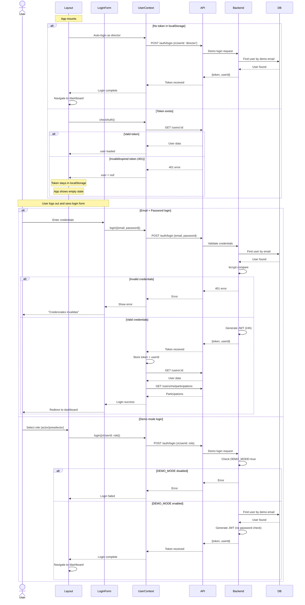
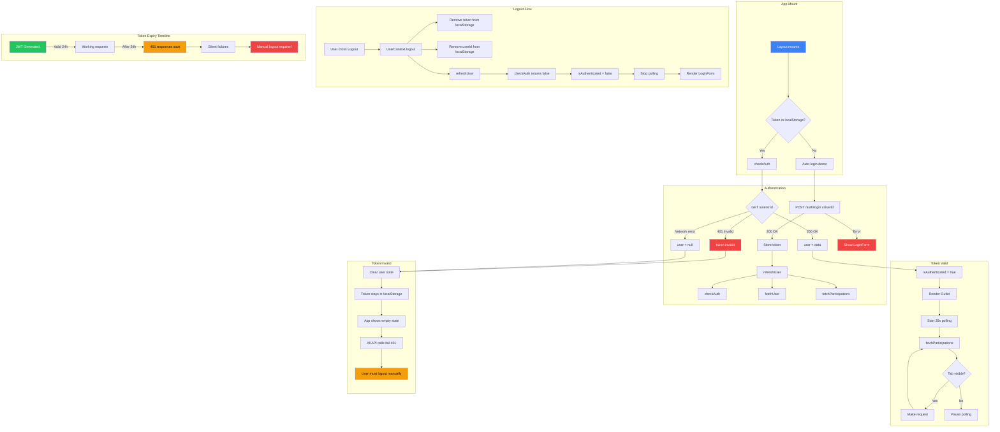

# Login Flow — Frontend Web

## Diagram 1: Login Interaction (sequenceDiagram)

## Diagram 2: Token Lifecycle & Auth Management (flowchart)

## Key Files

| File | Role |
|------|------|
| `frontend/src/components/Layout.tsx` | Gatekeeper — renders LoginForm or Outlet |
| `frontend/src/components/LoginForm.tsx` | Email/password form only |
| `frontend/src/context/UserContext.tsx` | Login/logout, token storage, polling |
| `frontend/src/api/client.ts` | HTTP client, cache, 401 handling |
| `backend/src/infrastructure/middleware/auth.ts` | JWT verification (throws on missing/invalid) |
| `backend/src/application/use-cases/LoginUseCase.ts` | Auth logic (email or demo) |

## Notable Behaviors

1. **Demo auto-login:** No token → auto-logs in as director (demo mode)
2. **No auto-logout on 401:** Invalid tokens stay in localStorage; user must logout manually
3. **No token refresh:** 24h expiry with no refresh mechanism
4. **Polling pauses when tab hidden:** Prevents wasted requests
5. **Race condition:** Layout uses sync `localStorage` check, but user data is async — stale token shows app shell briefly before failing
