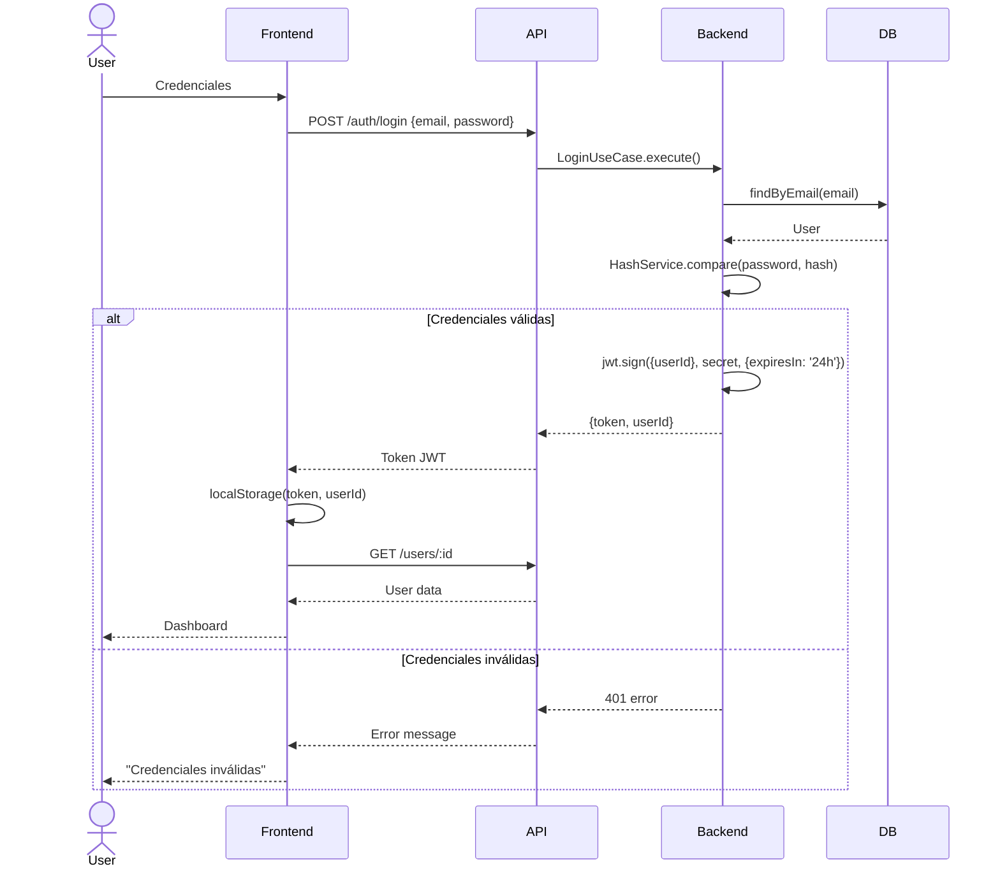
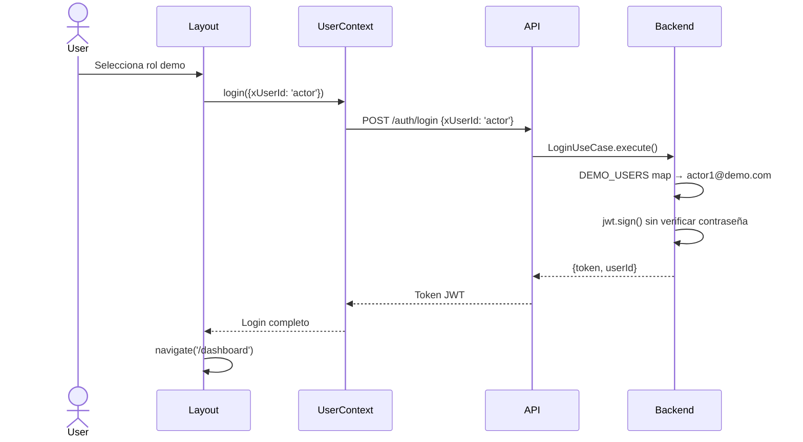
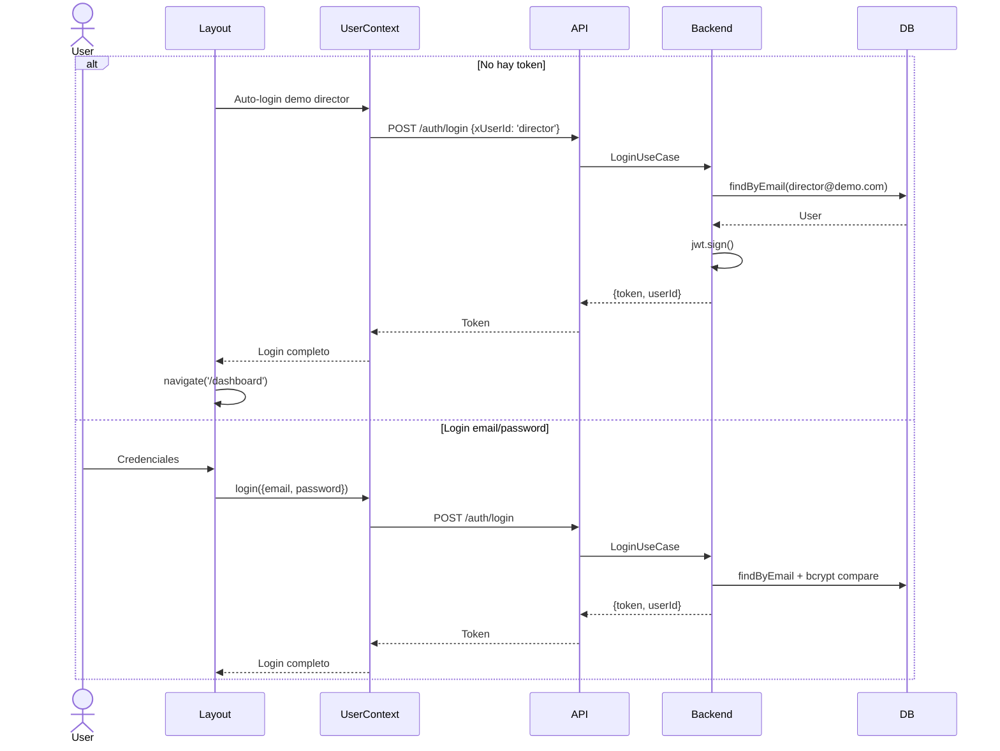
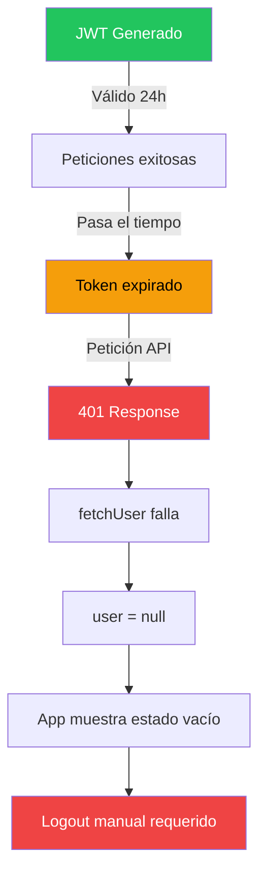
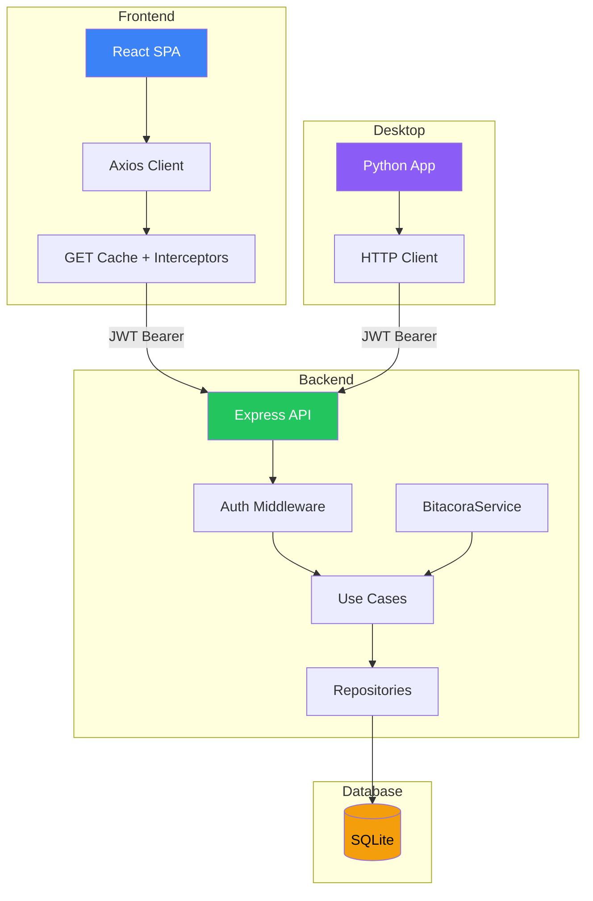

# Sistema de Gestión de Castings Desarrollado con Asistencia de Inteligencia Artificial

<!-- TOC -->

## Resumen

Este Trabajo de Fin de Máster describe el diseño e implementación de un sistema de gestión de castings para producciones audiovisuales, desarrollado íntegramente con asistencia de un agente de inteligencia artificial (OpenCode). El sistema permite a directores crear castings, gestionar rondas de selección, recibir vídeos de actores, revisarlos con puntuaciones y comentarios, y exportar los materiales seleccionados. La arquitectura sigue los principios de Clean Architecture y Domain-Driven Design, con un backend en TypeScript/Node.js, un frontend web en React y un cliente de escritorio en Python. El proceso de desarrollo se documenta como un caso de estudio sobre la viabilidad y limitaciones del desarrollo asistido por IA en un proyecto de ingeniería de software real.

---

## 1. Introducción

### 1.1 Contexto y motivación

La industria del audiovisual gestiona castings mediante procesos mayormente manuales: correos electrónicos, hojas de cálculo y reuniones presenciales. Este enfoque genera pérdidas de información, dificultad para comparar candidatos y falta de trazabilidad en las decisiones.

Paralelamente, las herramientas de inteligencia artificial para desarrollo de software están madurando rápidamente. Agentes como OpenCode prometen acelerar la escritura de código, pero su efectividad en proyectos reales — con requisitos ambiguos, refactoring continuo y necesidades de seguridad —まだno está completamente documentada.

Este TFM explora ambas necesidades: construir una herramienta útil para la gestión de castings, y evaluar críticamente cómo un agente de IA asiste (o limita) el desarrollo de software de calidad.

### 1.2 Objetivos

1. **Diseñar** un sistema de gestión de castings siguiendo Clean Architecture y DDD
2. **Definir** directrices de desarrollo asistido por IA (guía `AGENTS.md` como "constitución" del proyecto)
3. **Implementar** el sistema completo (backend, frontend web, cliente de escritorio) con asistencia de OpenCode
4. **Asegurar** la calidad mediante tests unitarios, de integración y E2E
5. **Documentar** el proceso de desarrollo como caso de estudio

### 1.3 Alcance

- **Backend:** API REST con Express, autenticación JWT, subida de vídeos, auditoría
- **Frontend Web:** React + Vite + Tailwind, interfaz responsiva con temas oscuro/claro
- **Cliente de escritorio:** Python + CustomTkinter, reproducción de vídeo con mpv, exportación comprimida
- **No incluye:** Despliegue en producción, escalabilidad horizontal, integración con servicios externos de vídeo

### 1.4 Estructura del documento

| Capítulo | Contenido |
|----------|-----------|
| 1 | Introducción, objetivos y alcance |
| 2 | Metodología y herramientas |
| 3 | Análisis del dominio y requisitos |
| 4 | Diseño y arquitectura |
| 5 | Implementación del backend |
| 6 | Implementación del frontend |
| 7 | Cliente de escritorio |
| 8 | Pruebas y validación |
| 9 | Resultados y conclusiones |
| Anexos | Diagramas, manual de usuario |

---

## 2. Metodología y herramientas

### 2.1 Metodología de desarrollo

El proyecto sigue una metodología iterativa y evolutiva basada en cuatro principios:

1. **Desarrollo guiado por especificación:** El archivo `AGENTS.md` funciona como constitución del proyecto. Define la arquitectura, patrones de código, comandos de verificación y reglas permanentes que el agente de IA debe respetar en cada interacción.

2. **Refactoring continuo:** El código se mejora incrementalmente. Cada nueva funcionalidad se integra con el diseño existente, y se eliminan abstracciones obsoletas (como la tabla `Director` separada o el Value Object `TypedId`).

3. **Tests como contrato:** Las pruebas verifican el comportamiento del sistema, no la implementación. Se ejecutan antes de cada cambio (`typecheck → test`).

4. **Documentación viva:** `AGENTS.md` se actualiza con cada cambio significativo. Se mantienen backups versionados en `docu/saves-agents/`.

### 2.2 Flujo de trabajo con el agente de IA

El desarrollo se organiza en ciclos:

1. El desarrollador describe una tarea o problema
2. El agente explora el código existente, busca patrones y lee contexto
3. El agente implementa la solución
4. Se ejecutan verificaciones automáticas (typecheck, tests)
5. Se actualiza `AGENTS.md` si hay cambios arquitectónicos

### 2.3 Stack tecnológico

| Capa | Tecnología | Propósito |
|------|------------|-----------|
| Runtime | Node.js + tsx | Ejecución TypeScript sin compilación |
| Framework web | Express 5 | API REST |
| ORM | Prisma 7 | Acceso a base de datos |
| Base de datos | SQLite | Almacenamiento ligero (dev/test) |
| Logging | Pino + pino-http | Logs estructurados con correlación |
| Auth | JWT + bcrypt | Autenticación y hash de contraseñas |
| Testing backend | Vitest + Supertest | Tests unitarios y de integración |
| Frontend | React + Vite + Tailwind | SPA responsiva |
| Testing frontend | Vitest + React Testing Library | Tests de componentes |
| E2E | Playwright | Tests end-to-end |
| Desktop | Python + CustomTkinter | Cliente de escritorio |
| Video | mpv (subprocess) | Reproducción en desktop |
| Asistente IA | OpenCode | Desarrollo asistido |

### 2.4 Roles del sistema

El sistema define tres roles con permisos diferenciados:

| Rol | Permisos |
|-----|----------|
| **Director** | Crear castings, gestionar rondas, revisar vídeos, puntuar, exportar |
| **Actor** | Enviar vídeos a rondas asignadas |
| **Preseleccionador** | Añadir actores a rondas donde está asignado como preseleccionador |

---

## 3. Análisis del dominio y requisitos

### 3.1 Conceptos del dominio

El dominio se compone de seis entidades principales:

| Entidad | Descripción |
|---------|-------------|
| **User** | Usuario del sistema (director, actor o preseleccionador) |
| **Casting** | Proyecto de casting con título, descripción y director |
| **Round** | Ronda de selección dentro de un casting (número, estado) |
| **Participant** | Relación usuario-casting o usuario-ronda con rol |
| **Submission** | Vídeo enviado por un actor a una ronda |
| **Bitácora** | Registro de auditoría de acciones del sistema |

### 3.2 Modelo de datos

```prisma
model User {
  id           String   @id
  name         String
  email        String   @unique
  password     String   // bcrypt hash
  createdAt    DateTime @default(now())
  updatedAt    DateTime @updatedAt

  submissions    Submission[]
  reviews        Review[]
  bitacora       Bitacora[]
  participants   Participant[]
}

model Casting {
  id          String   @id
  title       String
  description String
  createdAt   DateTime @default(now())
  updatedAt   DateTime @updatedAt

  rounds       Round[]
  participants Participant[]
  submissions  Submission[]
  bitacora     Bitacora[]
}

model Round {
  id         String   @id
  number     Int
  status     String   @default("active") // active | passed
  castingId  String
  createdAt  DateTime @default(now())
  updatedAt  DateTime @updatedAt

  casting      Casting        @relation(fields: [castingId], references: [id])
  participants Participant[]
  submissions  Submission[]
  bitacora     Bitacora[]
}

model Participant {
  id         String  @id
  userId     String
  castingId  String?
  roundId    String?
  role       String  // director | actor | preselector

  user     User     @relation(fields: [userId], references: [id])
  casting  Casting? @relation(fields: [castingId], references: [id])
  round    Round?   @relation(fields: [roundId], references: [id])

  @@unique([userId, castingId])
  @@unique([userId, roundId])
}

model Submission {
  id         String   @id
  actorId    String
  roundId    String
  videoUrl   String
  status     String   @default("pending") // pending | reviewed | selected | rejected
  duration   Int?                          // segundos
  createdAt  DateTime @default(now())
  updatedAt  DateTime @updatedAt

  actor  User   @relation(fields: [actorId], references: [id])
  round  Round  @relation(fields: [roundId], references: [id])
  review Review?
}

model Review {
  id           String  @id
  submissionId String  @unique
  directorId   String
  score        Int?    // 0-10 (mapeado a 1-5 estrellas en frontend)
  feedback     String?

  submission  Submission @relation(fields: [submissionId], references: [id])
  director    User       @relation(fields: [directorId], references: [id])
}

model Bitacora {
  id           String   @id
  timestamp    DateTime @default(now())
  userId       String
  action       String   // create_user, create_casting, submit_video, review_submission, add_participants, create_round
  details      Json?
  castingId    String?
  roundId      String?
  submissionId String?

  user User @relation(fields: [userId], references: [id])

  @@index([userId])
  @@index([action])
  @@index([timestamp])
}
```

### 3.3 Casos de uso principales

| Caso de uso | Descripción | Flujo principal |
|-------------|-------------|-----------------|
| CreateCasting | Crear un nuevo casting | Valida datos → crea Casting → crea Round 1 vacío → registra en bitácora |
| Login | Autenticar usuario | Valida credenciales → compara bcrypt → genera JWT (24h) |
| ManageRoundParticipants | Gestionar actores y preseleccionadores de una ronda | Valida participación del director → agrega/elimina participantes → opcionalmente crea nueva ronda |
| SubmitVideo | Enviar un vídeo a una ronda | Valida que el actor está en la ronda → crea Submission → registra en bitácora |
| ReviewSubmission | Revisar un vídeo enviado | Valida que el director está en el casting → valida estado → crea Score/Feedback → actualiza Submission |
| ExportRound | Exportar vídeos de una ronda | Descarga vídeos → comprime con ffmpeg → empaqueta en ZIP con manifiesto |

### 3.4 Arquitectura Clean Architecture

El sistema sigue las capas de Clean Architecture con dependencias que apuntan hacia adentro:

```
Domain ← Application ← Infrastructure ← Presentation
```

| Capa | Contenido |
|------|-----------|
| **Domain** | Entidades, Value Objects, excepciones de dominio, interfaces de repositorio |
| **Application** | Casos de uso, DTOs, orquestación de lógica |
| **Infrastructure** | Prisma repositorios, middlewares, servicios externos |
| **Presentation** | Rutas Express, frontend React, desktop Python |

---

## 4. Diseño y arquitectura

### 4.1 Arquitectura general

```
┌─────────────┐     ┌─────────────┐     ┌─────────────┐
│  Frontend   │────▶│  Backend    │────▶│  SQLite     │
│  React SPA  │     │  Express API│     │  Prisma ORM │
└─────────────┘     └─────────────┘     └─────────────┘
                           │
┌─────────────┐            │
│  Desktop    │────────────┘
│  Python     │
└─────────────┘
```

- **Frontend Web:** SPA en React con router, contextos globales y temas configurables
- **Backend:** API REST versionada (`/api/v1`), middlewares de autenticación y rate limiting
- **Desktop:** Cliente ligero que consume la misma API, con reproducción de vídeo nativa

### 4.2 Modelo de participantes

Una decisión arquitectónica clave fue unificar todos los roles en una sola tabla `Participant` en la capa de infraestructura:

```prisma
model Participant {
  userId     String
  castingId  String?  // ← para directores a nivel de casting
  roundId    String?  // ← para actores/preseleccionadores a nivel de ronda
  role       String   // director | actor | preselector
}
```

> **Nota:** La tabla `Participant` existe únicamente en la capa de infraestructura (Prisma). En el dominio, los participantes se representan como colecciones de entradas (`{ userId, role }`) dentro de las entidades `Casting` y `Round`, ya que no tienen identidad propia ni comportamiento significativo fuera de la entidad a la que pertenecen. Los prefijos de ID son: `usr-` para User, `cas-` para Casting, `rnd-` para Round, `sub-` para Submission. No existe prefijo para Participant porque no es una entidad de dominio.

Esta unificación eliminó la tabla separada `Director` y la tabla intermedia `RoundActor`, simplificando las consultas y eliminando inconsistencias.

### 4.3 Sistema de IDs

Los IDs son cadenas planas con prefijo, generadas por `genUUID(prefix)`:

```typescript
// domain/utils/genUUID.ts
export function genUUID(prefix: string): string {
  const nanoid = customAlphabet('0123456789abcdefghijklmnopqrstuvwxyzABCDEFGHIJKLMNOPQRSTUVWXYZ', 10);
  return `${prefix}-${nanoid()}`; 
}
```

Ejemplos: `usr-abc123`, `cas-def456`, `rnd-ghi789`

### 4.4 Decisiones de diseño clave

| Decisión | Alternativa descartada | Razón |
|----------|----------------------|-------|
| SQLite en desarrollo | PostgreSQL | Ligereza, sin configuración, portabilidad |
| JWT sin refresh tokens | Tokens rotativos | Simplificación para un caso de uso académico |
| Vitest sobre Jest | Jest + ts-jest | Mejor soporte ESM, rendimiento, integración con Vite |
| Prisma sobre TypeORM | TypeORM, Sequelize | Mejor DX, schema como fuente de verdad, migraciones |
| `genUUID()` en entidades | IDs en casos de uso | Las entidades controlan su propia identidad |
| Participant unificado | Tablas separadas por rol | Consistencia, consultas más simples |

---

## 5. Implementación del backend

### 5.1 Estructura del proyecto

```
backend/
├── prisma/
│   ├── schema.prisma        # Modelo de datos
│   ├── prisma.config.ts     # URL de conexión
│   ├── seed.ts              # Datos demo
│   └── backups/             # Copias de seguridad
├── src/
│   ├── domain/
│   │   ├── entities/        # User, Casting, Round, Submission, Review
│   │   ├── value-objects/   # Email, Password, Score, Feedback, Name
│   │   ├── errors/          # Errores de dominio
│   │   └── utils/           # genUUID
│   ├── application/
│   │   └── use-cases/       # Casos de uso
│   │       ├── rounds/      # ManageRoundParticipants, ReviewSubmission
│   │       └── ...
│   ├── infrastructure/
│   │   ├── api/v1/          # Rutas Express
│   │   ├── middleware/       # auth, requestContext, errorHandler
│   │   ├── persistence/     # Repositorios Prisma
│   │   ├── security/        # HashService (bcrypt)
│   │   ├── storage/         # videoUpload (multer)
│   │   └── logging/         # BitacoraService
│   └── index.ts             # Entry point
└── tests/
    ├── unit/domain/         # Value Objects y Entidades
    ├── unit/application/    # Casos de uso
    └── integration/         # Endpoints API
```

### 5.2 Autenticación y seguridad

El sistema implementa autenticación JWT con las siguientes características:

**Flujo de login (email/password):**



**Flujo de login demo:**



**Medidas de seguridad:**

| Medida | Implementación |
|--------|---------------|
| JWT_SECRET obligatorio | La aplicación lanza error si no está configurado |
| Contraseñas bcrypt | `HashService` con bcrypt, nunca texto plano |
| CORS configurable | `CORS_ORIGIN` env var (default: localhost:5173) |
| Helmet | Headers de seguridad, HSTS en producción |
| Rate limiting | Login: 10 req/15min, API: 100 req/15min |
| Sin logging de request body | Serializador pino-http excluye body |
| Guardia de producción | `NODE_ENV=production` + `DEMO_MODE=true` lanza error |

### 5.3 API versionada

Las rutas se organizan por prefijo de URL (`/api/v1`, `/api/v2`), con `/health` fuera de la versión.

**Rutas públicas:**

- `POST /api/v1/auth/login` — Login con email/password o modo demo

**Rutas protegidas (requieren JWT):**

- `GET /api/v1/users` — Listar usuarios
- `GET /api/v1/users/:id` — Obtener usuario
- `GET /api/v1/users/me/participations` — Participaciones del usuario autenticado
- `POST /api/v1/users` — Crear usuario
- `DELETE /api/v1/users/:id` — Eliminar usuario
- `GET /api/v1/castings` — Listar castings
- `GET /api/v1/castings/:id` — Detalle de casting
- `POST /api/v1/castings` — Crear casting
- `PUT /api/v1/castings/:id` — Actualizar casting
- `DELETE /api/v1/castings/:id` — Eliminar casting
- `GET /api/v1/rounds/:id` — Detalle de ronda
- `PATCH /api/v1/rounds/:id` — Actualizar ronda
- `DELETE /api/v1/rounds/:id` — Eliminar ronda
- `DELETE /api/v1/rounds/:roundId/participants/:userId` — Eliminar participante
- `POST /api/v1/rounds/participants` — Gestionar participantes o crear nueva ronda
- `POST /api/v1/submissions` — Enviar vídeo (JSON o multipart)
- `GET /api/v1/submissions/:id` — Obtener submission
- `DELETE /api/v1/submissions/:id` — Eliminar submission
- `PATCH /api/v1/submissions/:id/review` — Revisar vídeo
- `PATCH /api/v1/submissions/:id/metadata` — Actualizar metadatos (duración)

### 5.4 Sistema de auditoría (Bitácora)

El `BitacoraService` registra acciones del sistema de forma desacoplada:

```typescript
// Acciones registradas
type BitacoraAction =
  | 'create_user'
  | 'create_casting'
  | 'submit_video'
  | 'review_submission'
  | 'add_participants'
  | 'create_round';
```

El servicio maneja errores silenciosamente (nunca bloquea la operación principal).

### 5.5 Subida de vídeos

- **Almacenamiento:** `backend/uploads/videos/` con nombres `{timestamp}-{random}.{ext}`
- **Multipart:** Multer con MIME types permitidos (MP4, WebM, OGG, MOV, AVI, MKV)
- **Límite:** 100MB por archivo
- **Estat middleware:** Express sirve `/uploads` como archivos estáticos

### 5.6 Gobernanza de la base de datos

| Comando | Descripción |
|---------|-------------|
| `npm run db:push` | Sincroniza esquema sin pérdida de datos |
| `npm run db:backup` | Crea copia timestamped |
| `npm run db:reset` | Backup + reset (recomendado sobre `--force-reset`) |
| `npm run db:restore` | Restaura último backup + seed |

---

## 6. Implementación del frontend

### 6.1 Estructura

```
frontend/src/
├── api/client.ts              # Axios con interceptor JWT + caché GET
├── components/                # Layout, LoginForm, modales, ConfirmDialog
├── context/                   # UserContext, ThemeContext, ToastContext, UserCacheContext
├── pages/                     # Dashboard, Castings, CreateCasting, CastingDetail, RoundDetail
├── utils/                     # scoring.ts, submissionStatus.ts, roleConfig.ts
├── App.tsx                    # Rutas + providers
└── index.css                  # Tailwind + CSS custom properties
```

### 6.2 Sistema de temas

Seis temas disponibles, implementados con CSS custom properties:

| Tema | Clase CSS | Descripción |
|------|-----------|-------------|
| Light | `:root` | Tema claro por defecto |
| Dark | `.dark` | Tema oscuro |
| Ocean | `.theme-ocean` | Azul profundo |
| Forest | `.theme-forest` | Verde bosque |
| Sunset | `.theme-sunset` | Naranja cálido |
| Night | `.theme-night` | Negro puro |

La selección se persiste en `localStorage` y detecta la preferencia del sistema.

### 6.3 Contextos globales

| Contexto | Responsabilidad |
|----------|----------------|
| `UserContext` | Usuario autenticado, login/logout, participaciones, polling 30s |
| `ThemeContext` | Tema actual, persistencia, toggle |
| `ToastContext` | Notificaciones `showSuccess/showError/showInfo`, auto-cierre 4s |
| `UserCacheContext` | Caché en memoria de usuarios (`getUser`, `ensureUser`) |

### 6.4 Caché del navegador

El `client.ts` implementa caché GET en memoria:

| Endpoint | TTL |
|----------|-----|
| `/castings` | 5 min |
| `/rounds` | 2 min |
| `/submissions` | 30 s |
| `/participations` | 30 s |
| `/users` | 10 min |

La invalidación es específica por `roundId` extraído de las respuestas.

### 6.5 Componentes principales

**SubmitVideoModal:** Pestaña de subida de archivo (por defecto) con drag-and-drop y barra de progreso, y pestaña de URL.

**VideoPlayerModal:** Detección automática de YouTube/Vimeo/local, navegación `< >`, puntuación con estrellas, borde film-strip, captura de duración del vídeo.

**CreateNextRoundModal:** Filtro por puntuación (1-5 estrellas), casillas de actores, opción de crear ronda vacía, envío de correos.

**AddParticipantsModal:** Dos áreas de texto (actores, preseleccionadores), parseo de emails.

**ConfirmDialog:** Confirmación con gestión de foco, tecla Escape, botón de peligro.

### 6.6 Sistema de badges de rol

`utils/roleConfig.ts` centraliza los colores y etiquetas:

| Rol | Color | Badge |
|-----|-------|-------|
| Director | Azul | Director |
| Actor | Verde | Actor |
| Preseleccionador | Ámbar | Preselector |

---

## 7. Cliente de escritorio

### 7.1 Stack

| Tecnología | Propósito |
|------------|-----------|
| Python 3.10+ | Runtime |
| CustomTkinter | UI moderna |
| requests | Cliente HTTP |
| mpv (subprocess) | Reproducción de vídeo |
| ffmpeg | Compresión de vídeo |

### 7.2 Estructura

```
desktop/
├── src/
│   ├── main.py          # Entry point
│   ├── api/client.py    # HTTP client con JWT
│   ├── ui/
│   │   ├── login.py     # Ventana de login
│   │   ├── dashboard.py # Lista de castings
│   │   ├── casting_detail.py  # Detalle de casting
│   │   ├── round_detail.py    # Detalle de ronda
│   │   ├── video_player.py    # Reproductor con mpv
│   │   └── export_dialog.py   # Diálogo de exportación
│   ├── models/types.py  # Dataclasses
│   └── utils/
│       ├── config.py    # URL API, tema
│       ├── paths.py     # Carpeta Downloads (cross-platform)
│       ├── video_compressor.py  # Compresión ffmpeg
│       └── zip_exporter.py      # Empaquetado ZIP con manifiesto
├── requirements.txt
└── run.py               # Lanzador
```

### 7.3 Funcionalidades

- **Login:** Email/password o modo demo
- **Dashboard:** Lista de castings con badges de rol
- **Detalle de casting:** Participantes, rondas
- **Detalle de ronda:** Submissions, puntuaciones, botón de exportar
- **Reproductor de vídeo:** mpv, navegación prev/next, reseña con estrellas
- **Exportación:** Compresión ffmpeg (CRF 18/23/28), ZIP con `manifest.json`, ubicación: carpeta Downloads del usuario

### 7.4 Convención de nombres de exportación

```
{actor_name}#{submission_id}.mp4
```

El manifiesto incluye `actorName` y `actorEmail` (sin `actorId`).

---

## 8. Pruebas y validación

### 8.1 Estrategia de pruebas

| Nivel | Herramienta | Archivos | Cantidad |
|-------|-------------|----------|----------|
| Unitarias (backend) | Vitest | `tests/unit/` | 198 |
| Integración (backend) | Vitest + Supertest | `tests/integration/` | 23 |
| Unitarias (frontend) | Vitest + RTL | `frontend/src/**/*.test.tsx` | 18 |
| E2E | Playwright | `frontend/tests/e2e/` | 13 |

**Total: 252 tests**

### 8.2 Patrón de tests de Value Objects

```typescript
describe('Score', () => {
  it('should create valid score', () => {
    const score = Score.create(8);
    expect(score.getValue()).toBe(8);
  });

  it('should reject score below 0', () => {
    expect(() => Score.create(-1)).toThrow('Score must be between 0 and 10');
  });

  it('should reject score above 10', () => {
    expect(() => Score.create(11)).toThrow('Score must be between 0 and 10');
  });
});
```

### 8.3 Patrón de tests de casos de uso

```typescript
describe('CreateCastingUseCase', () => {
  it('should create casting with round 1', async () => {
    const casting = await useCase.execute({
      title: 'Test Casting',
      description: 'Test',
      directorEmail: 'dir@test.com',
      directorName: 'Director',
    });
    expect(casting.title).toBe('Test Casting');
    expect(mockRoundRepository.save).toHaveBeenCalled();
  });
});
```

### 8.4 Tests E2E

Los tests E2E verifican flujos completos:

- Login con email/password y modo demo
- Crear casting
- Navegar entre castings y rondas
- Enviar vídeo
- Revisar vídeo con puntuación
- Exportar vídeos

Se ejecutan con Playwright contra un servidor dev real.

### 8.5 Configuración de tests

```typescript
// vitest.config.ts
export default defineConfig({
  test: {
    fileParallelism: false,  // SQLite: un solo escritor
    globalSetup: './tests/globalSetup.ts',
    env: {
      DATABASE_URL: 'file:./test.db',
      JWT_SECRET: 'test-secret-for-ci-only',
    },
  },
});
```

---

## 9. Resultados y conclusiones

### 9.1 Logros alcanzados

| Logro | Estado |
|-------|--------|
| Backend completo (20+ endpoints, 198 tests) | ✅ |
| Frontend web (temas, contextos, modales, 18 tests) | ✅ |
| Cliente de escritorio (login, casting, reproductor, exportación) | ✅ |
| E2E tests (13 tests con Playwright) | ✅ |
| Autenticación segura (JWT, bcrypt, rate limiting, helmet) | ✅ |
| Sistema de auditoría (Bitácora) | ✅ |
| Gestión de participantes unificada | ✅ |
| Exportación de vídeos (compresión + ZIP) | ✅ |
| Documentación viva (AGENTS.md + diagramas) | ✅ |

### 9.2 Métricas finales

| Métrica | Valor |
|---------|-------|
| Tests backend | 198 |
| Tests integración | 23 |
| Tests frontend | 18 |
| Tests E2E | 13 |
| **Total tests** | **252** |
| Cobertura backend | ~99% |
| Endpoints API | 20+ |
| Temas UI | 6 |
| Roles de usuario | 3 |

### 9.3 Dificultades encontradas

1. **Modo demo inseguro:** La implementación inicial permitía peticiones sin token con un header `X-User-Id`, lo que representaba una vulnerabilidad de seguridad. Se resolvió unificando ambos flujos de login para que siempre produzcan JWTs.

2. **Modelo de participantes fragmentado:** Las tablas separadas `Director`, `Actor` y `RoundActor` generaban inconsistencias y consultas complejas. Se unificaron en una sola tabla `Participant` con campo `role`.

3. **SQLite y concurrencia:** SQLite solo permite un escritor a la vez. Se solucionó con `fileParallelism: false` en Vitest y configuración de timeouts.

4. **Prisma 7 y configuración:** La URL de conexión se movió de `schema.prisma` a `prisma.config.ts`, generando confusión inicial.

5. **Reproducción de vídeo en desktop:** pywebview y tkinterweb no funcionaron correctamente. Se recurrió a mpv como subprocess.

6. **Gestión de estado en frontend:** La complejidad de mantener usuario, participaciones, temas y caché de usuarios sincronizados requirió múltiples contextos y una estrategia de polling cuidadosa.

### 9.4 Trabajo futuro

| Área | Mejoras posibles |
|------|-----------------|
| **Seguridad** | Tokens httpOnly cookies, refresh tokens, autorización por rol en endpoints |
| **Frontend** | Lazy loading, optimización de bundle, PWA |
| **Backend** | PostgreSQL para producción, migraciones, health checks avanzados |
| **Desktop** | Empaquetado con PyInstaller, actualizaciones automáticas |
| **Funcional** | Notificaciones en tiempo real, chat entre participantes, calendario |
| **IA** | Evaluación cuantitativa de productividad, comparación con desarrollo sin IA |

### 9.5 Conclusiones

El proyecto demuestra que un agente de inteligencia artificial puede asistir efectivamente en el desarrollo de software de calidad, siempre que se proporcione un contexto claro (AGENTS.md), se verifiquen los resultados (tests), y se mantenga la supervisión humana en decisiones arquitectónicas y de seguridad.

Los principales beneficios observados fueron:
- **Velocidad de generación de código:** El agente generó estructuras completas de capas, tests y documentación en segundos
- **Consistencia de patrones:** Siguiendo las reglas de AGENTS.md, el código mantuvo estilo y arquitectura uniformes
- **Detección de bugs:** El agente identificó y corrigió problemas de seguridad (modo demo inseguro) y lógica (herencia incorrecta de participantes)

Las limitaciones principales fueron:
- **Necesidad de supervisión constante:** Decisiones de seguridad y arquitectura requirieron intervención humana
- **Dependencia del contexto:** Sin un AGENTS.md claro, el agente generaba código inconsistente
- **Falta de comprensión profunda:** El agente ejecuta patrones aprendidos pero no razona sobre trade-offs arquitectónicos complejos

---

## Anexos

### Anexo A: Diagrama de flujo de login



### Anexo B: Diagrama de ciclo de vida del token



### Anexo C: Diagrama de arquitectura del sistema



### Anexo D: Capturas de pantalla

| Pantalla | Descripción |
|----------|-------------|
|  | Vista general del dashboard con castings y badges de rol |
|  | Detalle de un casting con participantes y rondas |
|  | Detalle de una ronda con submissions y filtros |
|  | Reproductor de vídeo con puntuación y feedback |
|  | Modal de subida de vídeo (archivo y URL) |
|  | Ventana de login del cliente de escritorio |
|  | Dashboard del cliente de escritorio |
|  | Diálogo de exportación de vídeos |

> **Nota:** Las capturas se añadirán manualmente después de la generación de la memoria.

### Anexo E: Comandos de referencia

```bash
# Backend
cd backend && npx tsc --noEmit     # Typecheck
npm test                           # Tests (198)
npm run test:integration           # Integration (23)
cd backend && npm run dev          # Dev server

# Frontend
npm run test:front                 # Tests (18)
cd frontend && npx playwright test # E2E (13)
cd frontend && npm run dev         # Dev server

# Desktop
cd desktop && python3 run.py       # App desktop

# Base de datos
cd backend && npm run db:push      # Sync schema
cd backend && npm run db:reset     # Reset + backup
cd backend && npm run db:restore   # Restaurar backup
```

---

*Documento generado como parte del Trabajo de Fin de Máster en Inteligencia Artificial Aplicada al Desarrollo de Software.*
